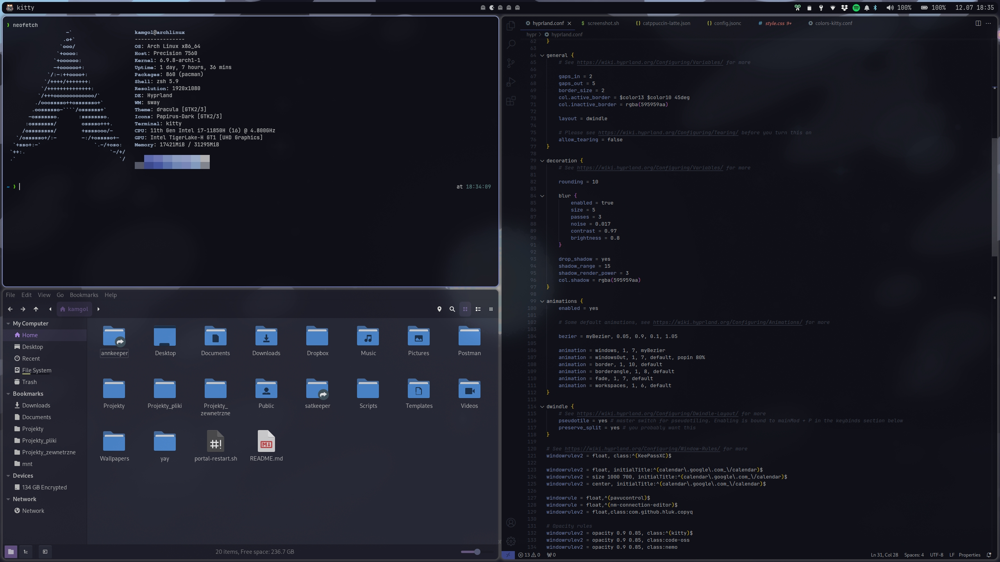
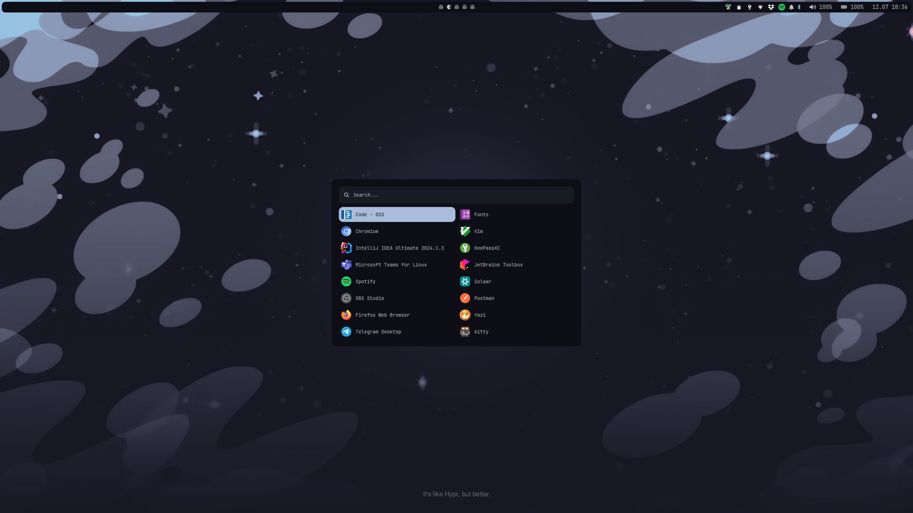
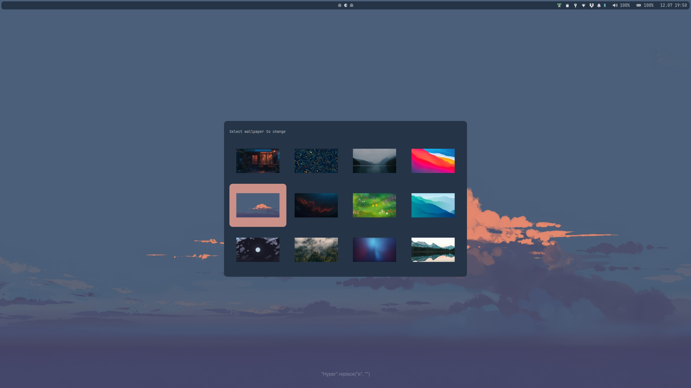

# Screenshots
### Preview


### App launcher


### Wallpaper picker


# Dependencies
### Hyprland
```
hyprland hyprpaper hyprlock hypridle xdg-desktop-portal xdg-desktop-portal-hyprland waybar rofi-lbonn-wayland-git swaync pipewire pavucontrol brightnessctl pamixer
```

### Network
```
network-manager network-manager-applet dnsutils dnsmasq
```

### Terminal
```
zsh fzf thefuck
```

### Theme
```
papirus-icon-theme nerd-fonts breeze breeze-gtk nwg-look dracula
```

### Pywal theming
```
python-pywal16 walogram-git
```

### Apps
```
kitty nemo nemo-fileroller keepassxc code gnome-font-viewer yazi
```

### Programming
```
docker docker-compose postman git gitflow-avh nvm jdk11-openjdk jdk21-openjdk
```

### Bluetooth
```
bluez bluez-utils
```

### Peripherals
```
solaar
```

### Dotfiles management
```
stow
```

### Misc
```
bongocat
```

### Screenshot
```
grim slurp satty
```


# Dotfiles repository
Dotfiles management is done using [GNU stow](https://www.gnu.org/software/stow/). For more information watch [dotfiles management with GNU stow video](https://www.youtube.com/watch?v=y6XCebnB9gs).

## Adding new files to configuration
1. Create new file inside repository. Remember that directory tree should correspond to local directory tree
2. Add file to git
3. Create symlink using GNU stow with command `stow .`


## Migrating to new machine
### Requirements
Make sure that following dependencies are installed on your system
```
pacman -S git stow
```

### Installation
First, clone repo to `$HOME` directory using git, then `cd` into it

```
git clone ...
cd dotfiles
```

then use GNU stow to create symlinks
```
stow .
```

if there are any files conflicting with this repo use following command. Beware that doing it will overwrite files in this repo with corresponding local ones
```
stow --adopt .
```


# TODO
* Split hypr config into multiple files
* Notifications
    * Configure notifications to show only on main screen
    * Notifications for laptop shortcut actions (check SwayOSD)
    * Add notification for UX feedback ie. screenshot taken, wallpaper changed
* Add QT theme
* Improve screenshot tool. Ie. migrate to flameshot
* Logitech Master MX 3s
    * Configure keybinds
* Powermenu
    * Add umountall before shutting down
* Create suspend script and use it in hypridle and powermenu
    * Pause all players
    * Mute microphone / unmute after suspend
* Pywal
    * Change colors in nemo (GTK)
    * Improve vscode colors (some text is very hard to read)
* Add support for both SWWW and hyrpaper
