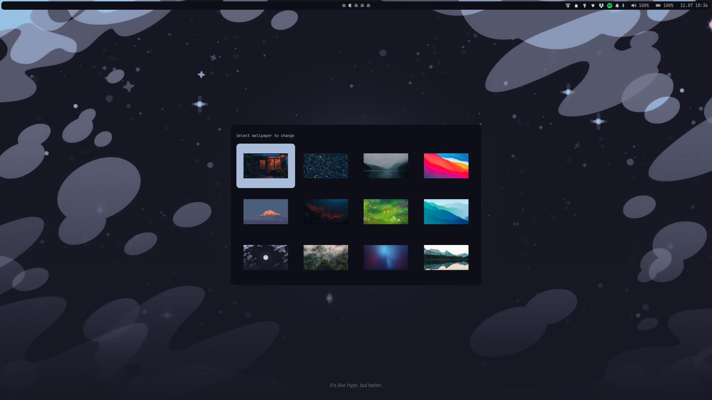

# Screenshots
### Preview

### App launcher

### Wallpaper picker

# Current dependencies:
### Hyprland
> hyprland hyprpaper hyprlock hypridle xdg-desktop-portal xdg-desktop-portal-hyprland waybar rofi-lbonn-wayland swaync pipewire pavucontrol grim slurp brightnessctl pamixer

### Network
> network-manager network-manager-applet dnsutils dnsmasq

### Theme
> papirus-icon-theme nerd-fonts breeze breeze-gtk nwg-look dracula

### Pywal theming
> pywal-16-colors walogram-git

### Apps
> kitty nemo nemo-fileroller keepassxc code gnome-font-viewer yazi

### Programming
> docker docker-compose postman git gitflow-avh nvm jdk11-openjdk jdk21-openjdk

### Bluetooth
> bluez bluez-utils

### Peripherals
> solaar

# Pywal
### Telegram
Walogram is used to generate theme https://codeberg.org/thirtysixpw/walogram. After generating first theme, remember to change theme in telegram following walogram doc https://codeberg.org/thirtysixpw/walogram#applying-theme

### Vscode
Install https://marketplace.visualstudio.com/items?itemName=dlasagno.wal-theme vscode extension

# GTK
More information
* https://wiki.archlinux.org/title/Cursor_themes 
* https://www.youtube.com/watch?v=CF3UFxH8d0Y

### Changing theme
* download theme and move to `/usr/share/themes`
* install and run `nwg-look` and change theme under `Widgets` tab

### Changing icons
* download theme and move to `/usr/share/icons`
* install and run `nwg-look` and change theme under `Icon theme` tab

### Changing cursor
* download cursor and move it to `/usr/share/icons`
* install and run `nwg-look` and change cursor under `Mouse cursor` tab
* edit `/usr/share/icons/default/index.theme` to match cursor directory
* create and edit `/home/USER/.icons/default/index.theme` to match cursor directory
* don't change anything in `.gtkrc-2.0`, this file will be overwritten by nwg-look

# TODO
* Hyprland config
    * Cleanup hyprland config
    * Split config into files
    * Add monitor profiles 3 monitors / single monitor
* Notifications
    * Configure notifications to show only on main screen
    * Notifications for laptop shortcut actions
* Add media center
* Virtual desktopesque workspaces - https://github.com/levnikmyskin/hyprland-virtual-desktops
* Add QT theme
* Add ARCH update checker
* Logitech Master MX 3s
    * Configure keybinds
* Powermenu
    * Add umountall before shutting down
* Create suspend script and use it in hypridle and powermenu
    * Pause all players
    * Mute microphone / unmute after suspend
* Checkout flameshot
* Create workspaces for spotify / discord + telegram
* Pywal
    * Change colors in nemo (GTK)
    * Figure out inactive border color, change active border colors to be clearly visible (Hyprland)
    * Improve vscode colors (some text is very hard to read)
* Rofi theme switcher
    * Stylize theme switcher - simple list with search bar
    * Add apply current wallpaper theme entry
* Rofi window / workspace switcher
    * Try to make it work like windows / kde alt + tab (holding alt to display etc.)
    * Try to implement secondary switcher for windows of current window type (if chrome is active, cycle between chrome instances etc.)
    * It should cycle like windows alt + tab, so recent windows should be at the top
* Hyprpaper
    * Make it use current wallpaper and current theme colors
